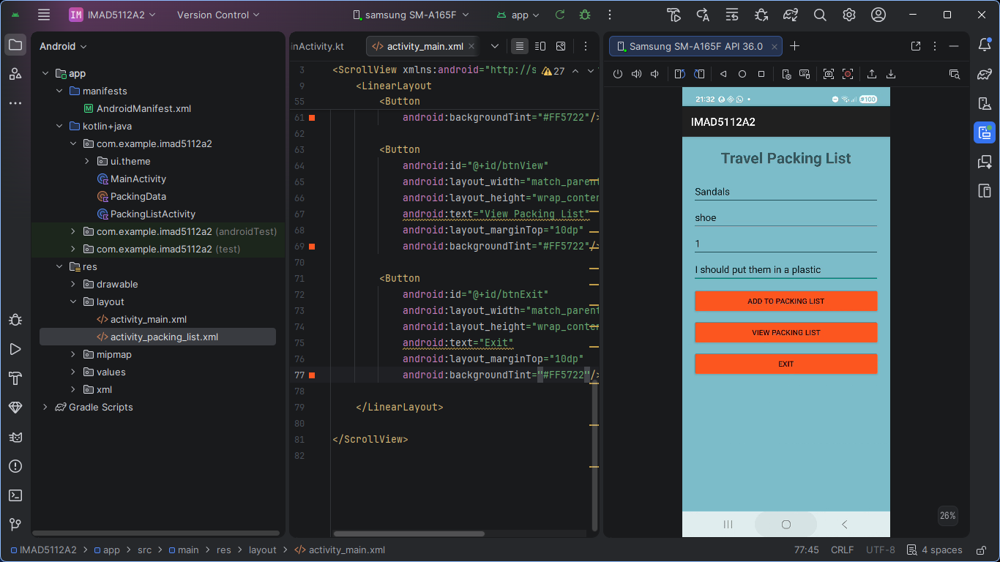
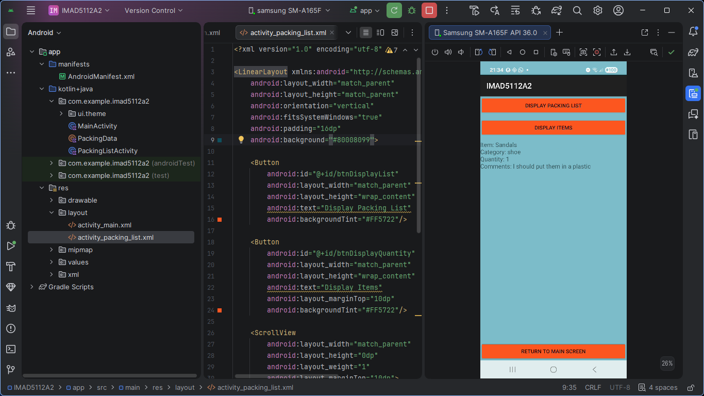
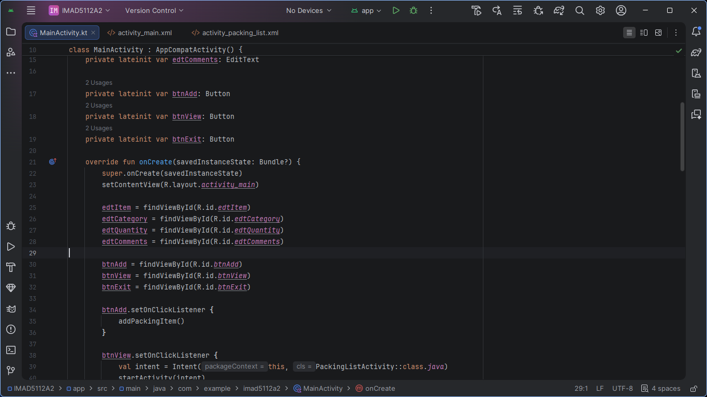
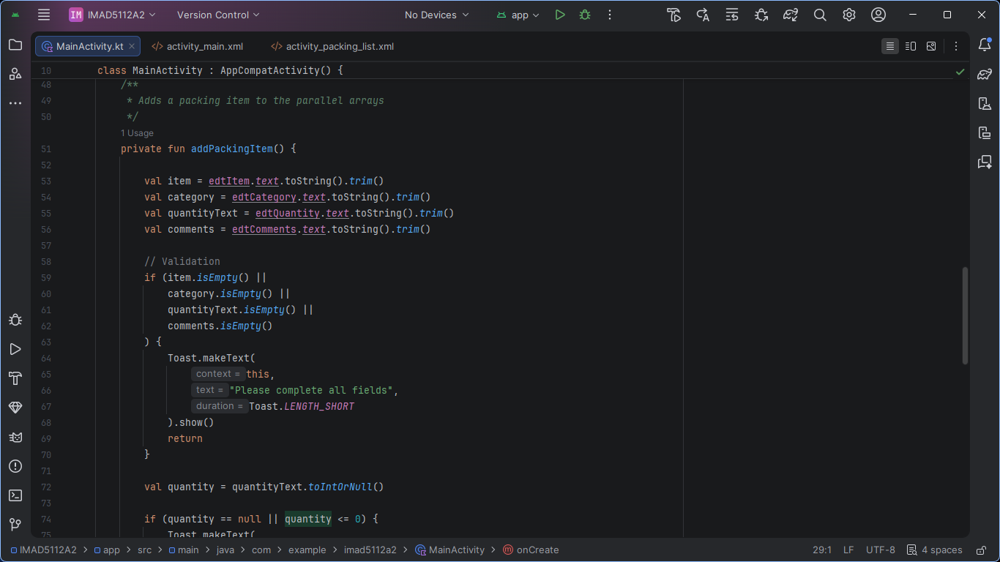
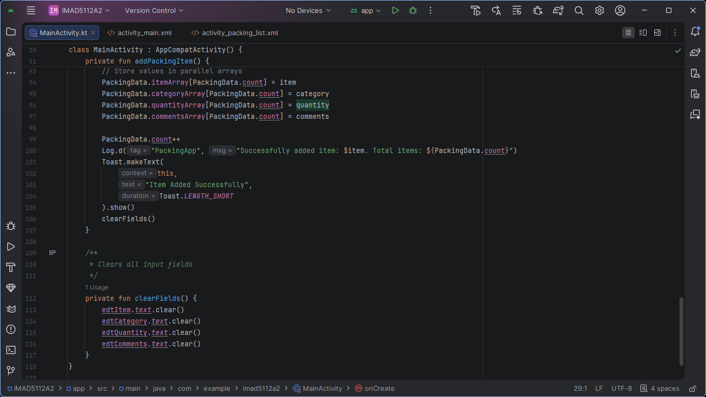

# IMAD5112A2
A school assignment project (Travel Packing List Manager)
A native Android productivity app built with Kotlin in Android Studio.

Keep track of everything you need for your next trip, categorise your essentials, and never forget your passport again!

The app safely stores these entries and provides detailed, scrollable views of the packing list, including a special filter to highlight items with a quantity of two or more.

# Features
Main Input Screen — The control centre for adding new items, featuring:

Input fields for Item Name, Category, Quantity, and Comments.

An Add To Packing List button with robust error handling (prevents blank fields, zero quantities, and respects a 20-item maximum limit).

Navigation buttons to view the list or safely exit the app.

# Screenshots

## The first screen when the application starts(The main screen)

## The display screen(to display items)

## Source code

